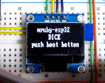

# Electronic Dice with mruby-esp32

This script is an electronic dice with mruby-esp32.

# Usage

### Demo movie



When you use the SSD1306-I2C, the wiring is shown below.
```
    SSD1306       NodeMCU-32S(ESP32)
        VCC ----> 3v3  (3.3V)
        GND ----> GND
        SCL ----> GPIO 22
        SDA ----> GPIO 21
```
and rewrite the "Select Output device" code to "SSD1306_I2C = true".
```ruby
# Select output device
serial      = true
SSD1306_i2c = true
```
In advance, you will need to add several mrbgems to `esp32_build_config.rb`
```ruby
  conf.gem :core => "mruby-toplevel-ext"
  conf.gem :github => "mruby-esp32/mruby-esp32-system"
  conf.gem :github => 'icm7216/mruby-esp32-i2c-ssd1306'
  conf.gem :github => 'icm7216/mruby-esp32-random'
```

## How to shake the Dice?
*   push the boot button (GPIO0) on board.

# License

under the MIT License:
- see LICENSE file